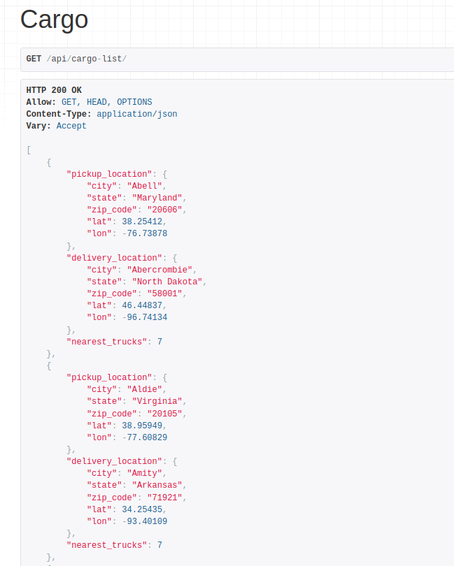
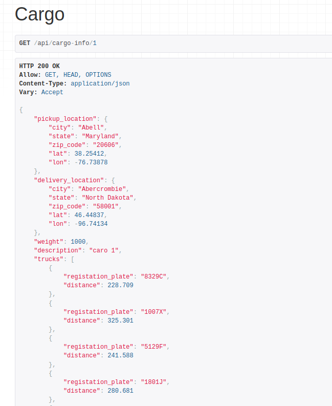
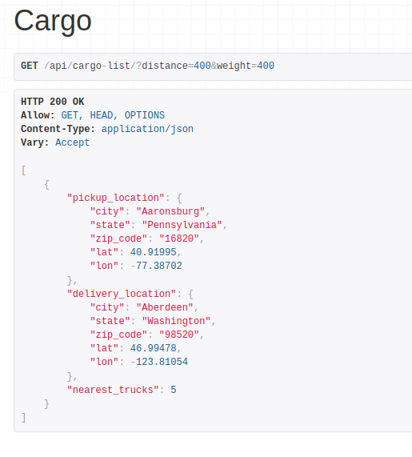

# Сервис поиска ближайших машин для перевозки грузов.

### Установка:

Клонировать репозиторий

```bash
git clone git@github.com:CaDiBob/truck-search.git
```

Предварительная настройка:

Файл .envExample переименовать в .env и заполнить нужными данными.

```bash
DEBUG= #дебаг
ALLOWED_HOSTS= #разрешенные хосты - 127.0.0.1,localhost
SECRET_KEY= #секретный ключ Django любая последовательность символов

POSTGRES_DB= #имя базы данных
POSTGRES_USER= #имя пользователя базы данных
POSTGRES_PASSWORD= #пароль базы данных
```

### Запуск с помощью docker-compose:

Собрать контейнер:

```bash
sudo docker compose build
```

Запустить контейнер:

```bash
sudo docker compose up
```

Открыть еще одно окно терминала выполнить миграции и заполнить бд тестовыми данными и создать суперпользователя:

Запустить миграции:

```bash
sudo docker compose run --rm backend sh -c "python backend/manage.py migrate"
```

Заполнить БД локациями

```bash
sudo docker compose run --rm backend sh -c "python backend/manage.py load_csv backend/uszips.csv"
```
 Заполнить БД грузовиками по умолчанию 20 шт., принимает необязательный аргумент целое число какое количество грузовиков создать.

```bash
sudo docker compose run --rm backend sh -c "python backend/manage.py create_trucks"
```
 Cоздать суперпотльвателя для админ-панели

```bash
sudo docker compose run --rm backend sh -c "python backend/manage.py createsuperuser"
```

[http://127.0.0.1:8000/api/add-cargo/](http://127.0.0.1:8000/api/add-cargo/) `добавить груз`

[http://127.0.0.1:8000/api/cargo-list](http://127.0.0.1:8000/api/cargo-list) `просмотреть список грузов`


[http://127.0.0.1:8000/api/cargo-info/айди-груза](http://127.0.0.1:8000/api/cargo-info/айди-груза) `просмотреть один груз`


[http://localhost:8000/api/cargo-list/?distance=растояние&weight=вес](http://localhost:8000/api/cargo-list/?distance=400&weight=400) `фильтр по весу и растоянию до груза`


[http://127.0.0.1:8000/api/cargo/айди-груза](http://127.0.0.1:8000/api/cargo/айди-груза) `обновить/удалить груз`

[http://127.0.0.1:8000/api/truck/айди-грузовика](http://127.0.0.1:8000/api/truck/айди-грузовика) `обновить локацию грузовика`
